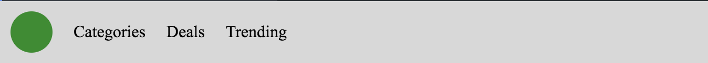
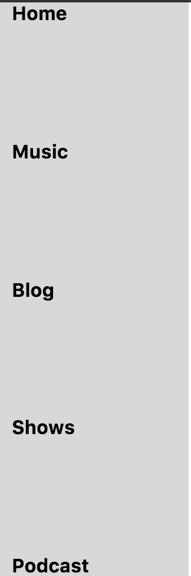
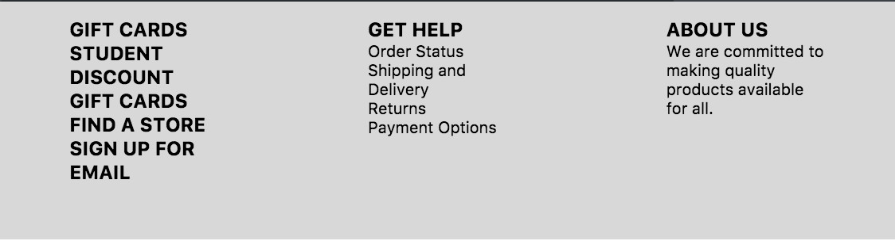
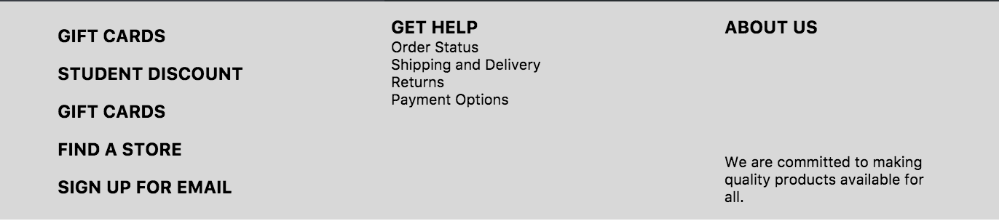

# Flexbox

## The Goal

Now that you've learned the in and outs of CSS Grid, you may think you've found the solution to all of your layout needs. But, as all of your favorite infomercials will tell you... there's more! Flexbox is a great way to easily achieve **one dimensional** layouts.

## The Lab
In this lab we'll start by looking at some of the core concepts of Flexbox and how to use them in our websites to create the most common webpage components.

You may find [this link](https://css-tricks.com/snippets/css/a-guide-to-flexbox/) useful as you work through the exercises below!

For each task you'll be working in a separate html and css file. The html will be given to you and you'll be adding style rules to match a given mockup.

#### The Navigation Bar:
For this task you'll be working with `nav_bar.html` and `nav_bar.css`. If you preview the file you may notice that your navbar doesn't look very.... navbar-esque right now. Let's start off by getting everything into one row. Check out your html file and figure out what your container element for your flexbox should be. Then, manipulate the **display** and **align-items** properties to recreate the image below.

Note that the default values for **flex-direction** and **justify-content** are row and left respectively.

#### The Sidebar:
Many modern websites also use sidebars to help users navigate through their content. In this task you'll be working on `side_bar.html` and `side_bar.css`. Use the **display**,  **flex-direction** and **justify-content** properties to math the mockup below.

#### The Footer:
Now you'll be working in `footer.html` and `footer.css` to create a footer component for your page. Create the footer you see below using the same properties that you explored in the previous tasks.

#### Extension:
1) In previous labs you saw that you could use nested grids to create more complex layouts. Luckily, you can do the same thing in flexbox! Go back into your `footer.css` file and add additional styling to achieve the mockup below. You'll want to treat each item div as it's own 'container' element and use the same properties you've seen throughout this lab on each one.

